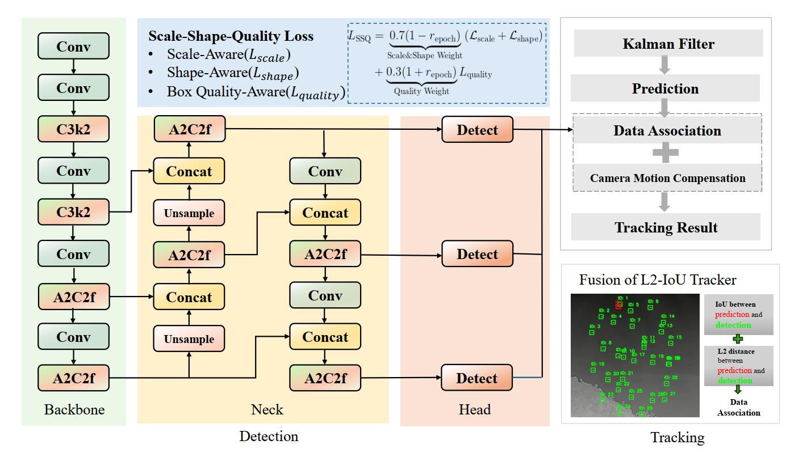

# [DIST-Track]

## 🏆 Dist-Tracker: A Small Object-aware Detector and Tracker for UAV Tracking (CVPRW2025)

As the core technology of the international championship team in ​Track 3 (Multi-UAV Complex Scene Tracking)​​ of the ​4th Anti-UAV Challenge at CVPR, ​Dist-Tracker​ innovatively combines an enhanced detector with a lightweight tracker architecture. The system achieves breakthrough performance on ​300 video sequences (200 for training, 100 for testing)​​ captured in ​thermal infrared (640×512 resolution)

- ​**​[2025] [​Track 3 (Multi-UAV Complex Scene Tracking)​​ of the ​4th Anti-UAV Challenge at CVPR]​**​

- The international championship **(Top-1 MOTA: 81.32%)**

Paper:​​ https://openaccess.thecvf.com/content/CVPR2025W/Anti-UAV/papers/Wang_Dist-Tracker_A_Small_Object-aware_Detector_and_Tracker_for_UAV_Tracking_CVPRW_2025_paper.pdf

## 🛠️ Pipeline



## 📌 Key innovations

- SSQ-Enhanced Detection Framework :​ Built on ​YOLOv12, integrating ​Scale/Shape/BoxQuality-aware mechanisms

- L2-IoU Hybrid Metric Tracker​ :​ ​Improved SORT framework, combining ​IoU & L2 distance metrics

- GMC (Global Motion Compensation) module​ based on ​sparse optical flow, mitigating camera shake and fast motion

## 📊 Tracking Results

Performance Visualization


## 🗂 Dataset Organization

Directory Structure

```bash
dataset/
├── train/
│   ├── images/          # Thermal images (640x512)
│   │   ├── seq01_0001.png
│   │   └── ...
│   └── labels/          # YOLO-format annotations
│       ├── seq01_0001.txt
│       └── ...
├── test/                # Same structure as train/
└── Videos/              # Official test videos
```

​Annotation Format (YOLO)​

Each .txt file contains one line per object:

```bash
<class_id> <x_center> <y_center> <width> <height>
```

Coordinates are ​normalized​ to [0, 1]

class_id=0 for UAVs (only one class in this dataset)

## 🚀 Qucik start

### ​Environment Configuration

```bash
# Run the following command to create the environment using the YAML file:
conda env create -f environment.yml

# Once installed, activate the environment:
conda activate [environment_name]

# (Replace [environment_name] with the actual name defined in environment.yml—typically found at the top of the file, e.g., name: dist_tracker)
```

### Run Inference

```bash
# First, ensure you're in the correct directory
cd Dist-Track/ultralytics/

# Track all videos in dataset:
python track.py

# Track single video:
python track_one.py

# Train model:
python train.py
```
